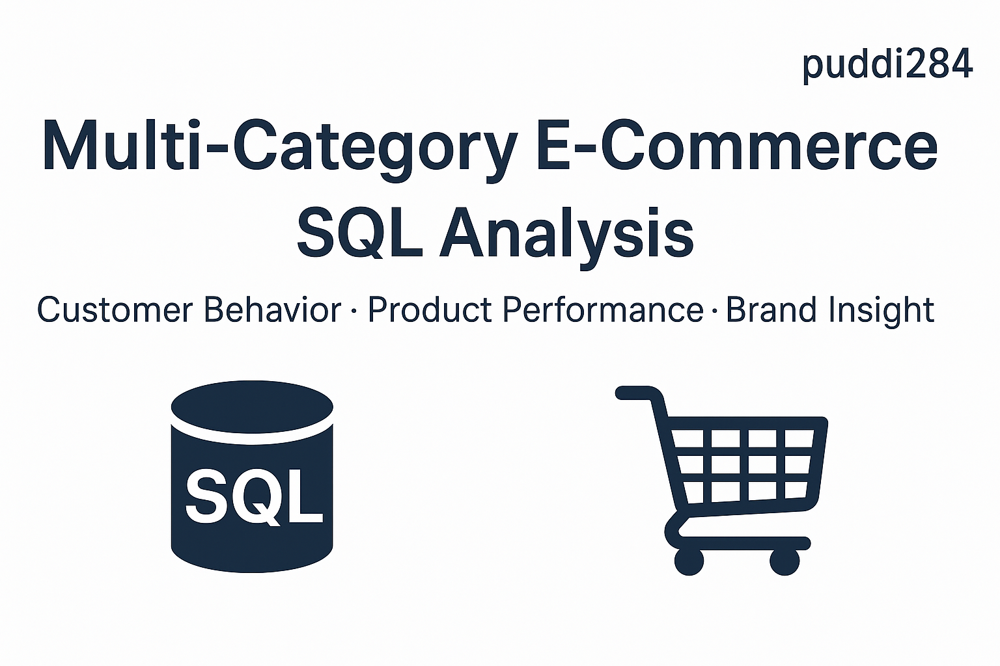
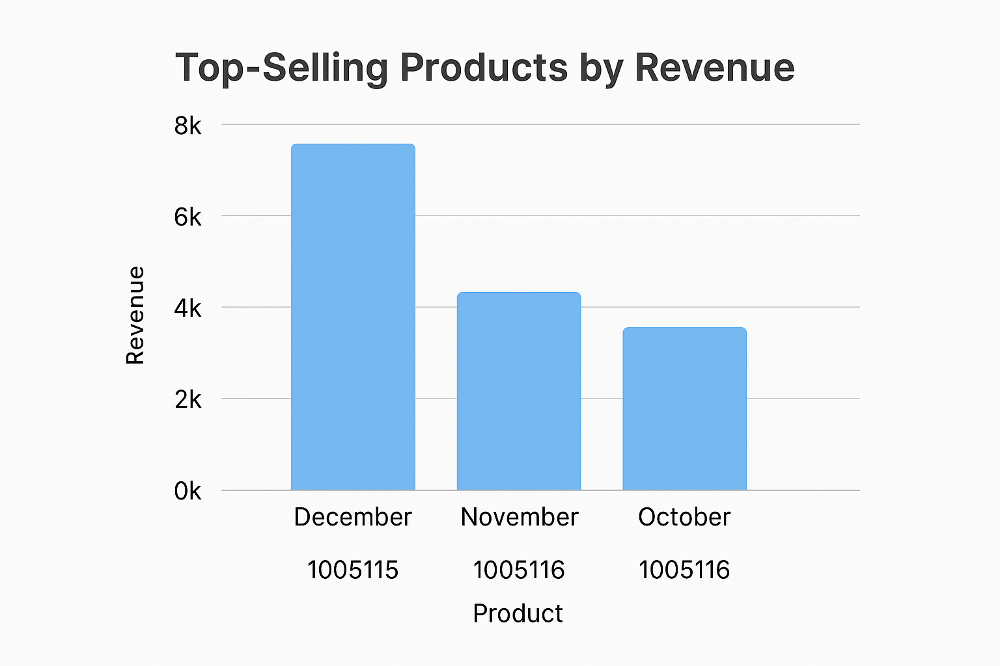
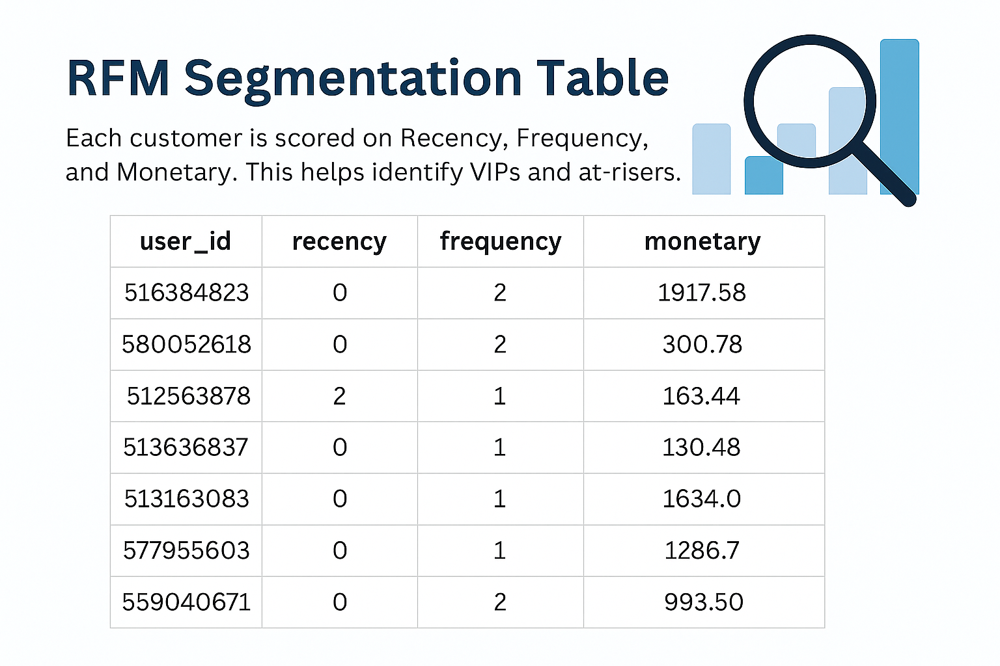
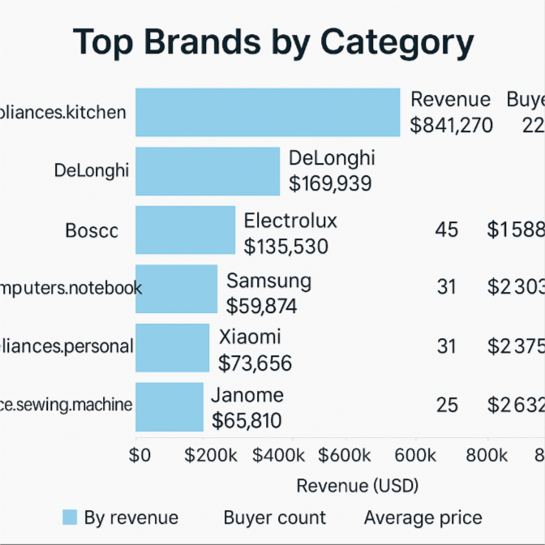
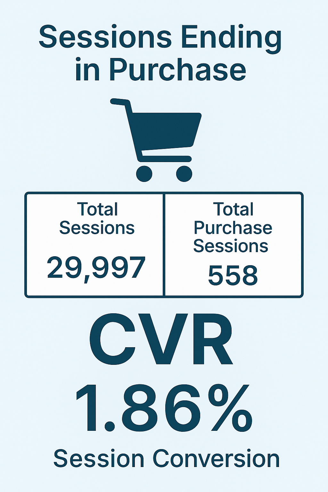

  

# 🛒 Multi-Category E-Commerce SQL Analysis

This project analyzes transaction data from a large multi-category online retail store over a 3-month period using SQL. The goal is to understand user behavior, identify top-performing products, and assess brand/category performance using structured queries.

---

## 🔍 Project Overview

The SQL script performs the following key analyses:

- Merge and clean raw data from October, November, and December
- Convert string timestamps into proper `DATETIME` format
- Identify top-selling products, categories, and brands
- Segment users using RFM (Recency, Frequency, Monetary) analysis
- Evaluate session-level conversion rates
- Determine dominant brands within each product category
- Count unique buyers and compute average product prices
- Build query-ready base tables and views

---

## 🖼 Sample Results

### 📦 Top-Selling Products

### 🧠 RFM Segmentation

### 🏷️ Brand by Category

### 🔁 Session Conversion Rate

---

## 📁 Files Included

- `code.sql`: Main SQL script for all queries and transformations  
- `report.md`: Full analytical report with visuals and summaries  
- `thumbnail.png`: Repository banner  
- `image/`: Folder containing all visualizations used in the report  
- `data/`: Raw CSV files for Oct–Dec 2019

---

## ▶️ How to Use

1. Import the CSVs inside `/data` into your SQL database as tables:
   - `Ecommerce_oct`
   - `Ecommerce_nov`
   - `Ecommerce_dec`

2. Run the queries in `code.sql` step by step

3. Visualize results using query results or provided images

---

## 🛠 SQL Techniques Used

- `WITH` CTEs for modular logic
- `ROW_NUMBER()` for session and monthly ranking
- `DATEDIFF`, `DATENAME`, `DATEPART` for time manipulation
- Aggregations: `SUM()`, `AVG()`, `COUNT(DISTINCT)`
- Conditional logic: `CASE WHEN ...`
- `STUFF(...) FOR XML PATH('')` for string aggregation in legacy SQL Server

---

## 📬 Contact

For questions or collaboration:
- 📧 Email: buudiem284@gmail.com  
- 📞 Phone/Zalo: (+84) 812698938
