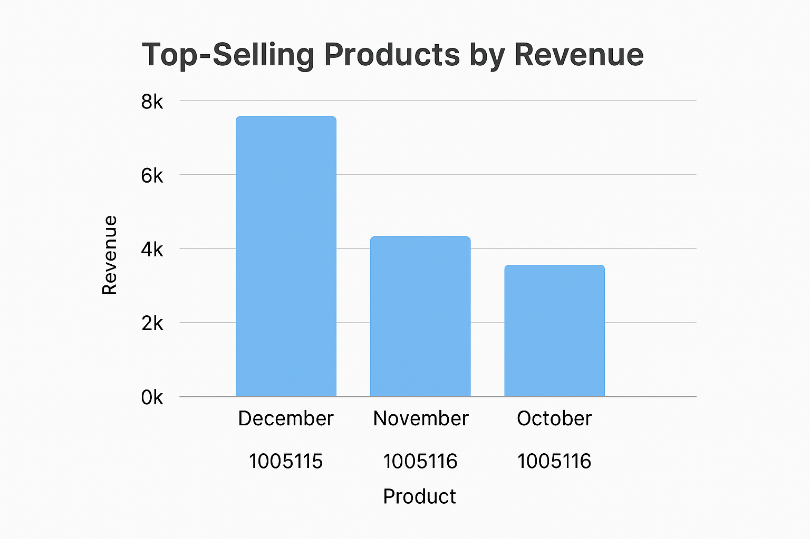
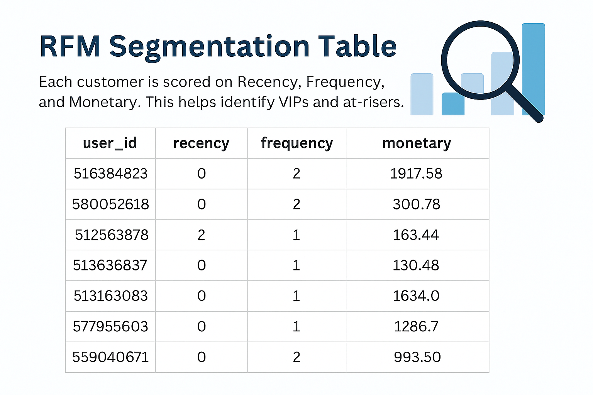
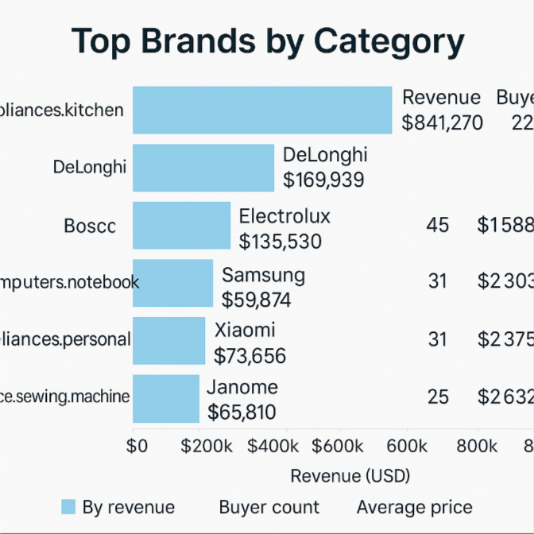
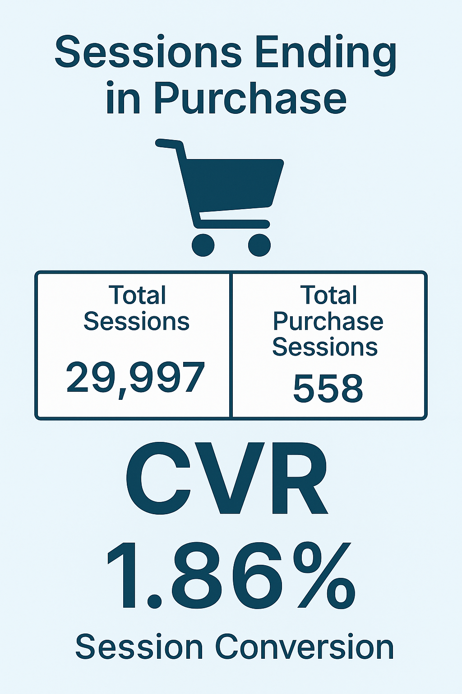

# 📊 E-Commerce SQL Analysis Report

### 👤 Author: **Dang Nguyen Buu Diem**  
### 📁 Project: **Customer Behavior & Product Performance Analysis in a Multi-Category Online Retail Platform**  
### 🛠 Technology: **SQL Server**

---

## 📌 1. Project Objective

Analyze 3 months of transaction data (Oct–Dec 2019) from a large multi-category e-commerce platform to:

- Identify top-selling products, categories, and brands  
- Understand customer behavior through sessions and RFM segmentation  
- Measure conversion rates from session flows  
- Determine brand dominance in each product category  
- Normalize time data and optimize query logic  

---

## 🧱 2. Data Overview

The project uses 3 monthly CSV datasets: `Ecommerce_oct`, `Ecommerce_nov`, `Ecommerce_dec`, each containing:

- `event_time` (as string datetime)  
- `user_id`, `user_session`  
- `product_id`, `category_code`, `brand`, `price`  
- `event_type` (view, cart, remove_from_cart, purchase)  

---

## 🔍 3. Key Analyses

### 🛍 Top-Selling Products

Top 3 products were extracted for each month using revenue (`SUM(price)`) and purchase count.

---

### 🧠 RFM Segmentation

Each customer was analyzed by **Recency**, **Frequency**, and **Monetary** metrics to highlight VIPs, loyal users, and those at risk of churn.

---

### 🏷️ Brand Dominance by Category

Brands with the highest revenue and buyer counts were ranked within each category.

---

### 🔁 Session Conversion Rate

From **29,997 total sessions**, **558 ended in purchase**, yielding a **conversion rate (CVR) of ~1.86%**.

---

## 🛠 SQL Techniques Used

- `ROW_NUMBER()` for intra-group ranking  
- `DATEDIFF`, `DATENAME`, `DATEPART` for time extraction  
- `CASE WHEN` for RFM scoring  
- `STUFF(... FOR XML PATH(''))` as a workaround for `STRING_AGG` in older SQL versions  
- Created `event_time_dt` column to cast timestamp strings into proper `DATETIME`  

---

## 📎 Included Files

- `SQL_Project.sql`: All SQL queries used for analysis  
- `README.md`: GitHub repository documentation  
- `images/`: Folder with all visualizations used in this report  
- This report (`report.md`)  
